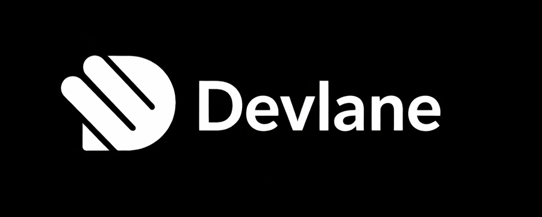

# Devlane

**Issue tracking and project management for development teams.**

Devlane helps you organize work in workspaces and projects: track issues, assign owners, group work into cycles and modules, and keep everything in sync with a clear activity feed and rich comments.

---

## Installation

You can run Devlane in two ways:

- **Self-hosted** — Run the API and UI on your own infrastructure. You need PostgreSQL, Redis, and optionally RabbitMQ and MinIO (see the API and UI READMEs for environment variables and setup).
- **From source** — Clone the repo and run the API and UI for local development or your own deployment.

| Method        | Notes |
| ------------- | ----- |
| Docker        | Use the API and UI Dockerfiles (or compose) with the required env and database migrations. |
| From source   | See [Local development](#local-development) below. |

Instance administrators can manage workspaces and instance settings from the instance-admin area after initial setup.

---

## Features

- **Issues (work items)** — Create and manage issues with description, state, priority, assignees, labels, and parent/child links. Sub-issues and a properties sidebar keep context in one place.
- **Cycles** — Group issues into time-boxed cycles and track progress.
- **Modules** — Break projects into modules for clearer scope and status.
- **Views** — Filter and save views so you can focus on the right issues.
- **Activity and comments** — Each issue has an activity feed. Add and edit comments with a rich text editor (bold, lists, code blocks). Edit and delete comments with relative timestamps.
- **Pages** — Lightweight docs and notes linked to your workspace.
- **Analytics** — Overview and work-item analytics to see progress and trends.
- **Workspace settings** — Manage members (with display names), projects, and workspace-level configuration.

---

## Local development

1. **API** — From the `api` directory, copy `.env.example` to `.env`, set your PostgreSQL and Redis (and optional RabbitMQ/MinIO) settings, run migrations, then start the server (see `api/README.md`).
2. **UI** — From the `ui` directory, run `npm install` and `npm run dev`. Point the UI at your local API using the configured base URL.
3. **First run** — Complete instance setup in the browser (create admin account, then create a workspace and project).

For contribution workflow and code style, see [CONTRIBUTING](CONTRIBUTING.md) if present.

---

## Built with

- **API:** Go, Gin, GORM, PostgreSQL, Redis; optional RabbitMQ and MinIO.
- **UI:** React, React Router, Vite, TypeScript, Tailwind CSS, TipTap (rich text), Recharts.

---

## Documentation

- **API** — See `api/README.md` for setup, env vars, and running the server.
- **UI** — See `ui/README.md` for front-end setup and scripts.

---

## Contributing

Contributions are welcome. Please open an issue for bugs or feature ideas, and read [CONTRIBUTING](CONTRIBUTING.md) for pull request and development guidelines.

---

## License

This project is licensed under the **Devlane Software License**. It grants you broad use and modification rights (MIT-style) but does not allow selling the software or offering it as a hosted/subscription service to third parties. See [LICENSE](LICENSE) for the full text. This license is not OSI-approved open source.
